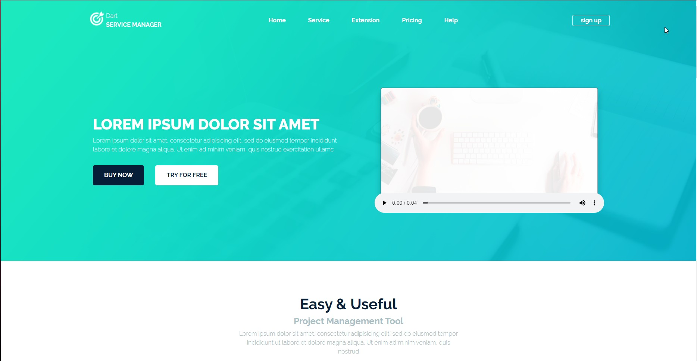

# About Custom_theme

I made this custom theme as a training for stretching the layout on Wordpress

In this work, I have implemented such functionality as a slider, drop-down lists and a feedback form. All of the above functionality was written in JavaScript.

# Preview

# How install theme?

 1) Download repository
 2) Create folder with name theme and unpacking files repository in her
 3) Drag folder theme in folder themes (domainname/wp-content/themes)
 4) Activate the theme in your Wordpress dashboard
 5) Complete
